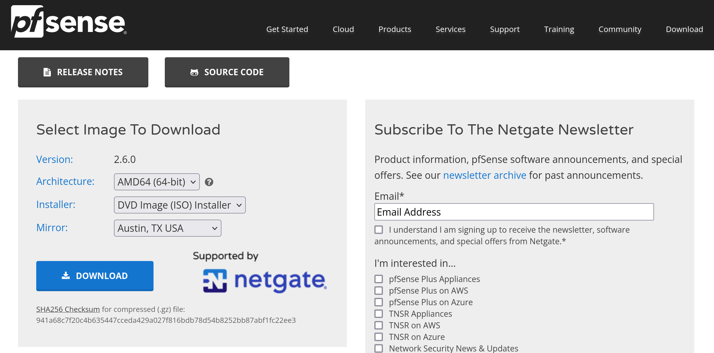
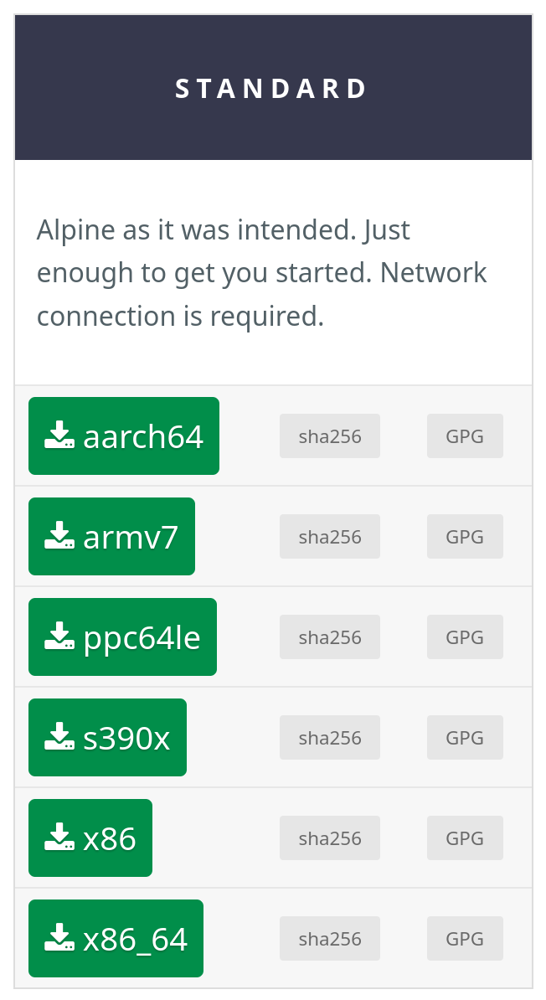

# Part 1. Setup

**Please [verify the checksum](https://www.redhat.com/sysadmin/hashing-checksums) of any files you download.**

## Downloading VirtualBox
The first thing you'll need is VirtualBox for creating the virtual machines. pfSense and Alpine will both be installed on it. The exact platform package you will need depends on the operating system you're using. You can find the various platform packages at https://www.virtualbox.org/wiki/Downloads.

## Downloading pfSense
pfSense is a virtual router and/or firewall system that can be installed onto a regular disk partition or onto a virtual machine. Grafana will use the metrics gathered from your instance of pfSense as a data source for monitoring.

1. Go to https://www.pfsense.org/download/
2. For architecture, select AMD64 (64-bit) and for installer, select DVD Image (ISO) Installer.

3. Click "DOWNLOAD". Make sure you know the location of the saved file.

## Downloading Alpine
Technically speaking, we could use just about any device with a NIC to connect to pfSense as a node on its network. However, in order to make this process simple and isolated, we choose to use a virtual machine for this test environment. Alpine Linux is mostly an arbitrary distribution choice, but a notably lightweight one that works well as a node on this network.

1. Go to https://www.alpinelinux.org/downloads/
2. Under "STANDARD", find the appropriate architecture for your system and download that version. In my case, I am running Fedora 36 on Intel architecture, so I have chosen x86_64.

3. Click on the green box containing your architecture to download Alpine, and be sure to know where you saved it.

**We are now ready to create virtual machines for pfSense and Alpine**