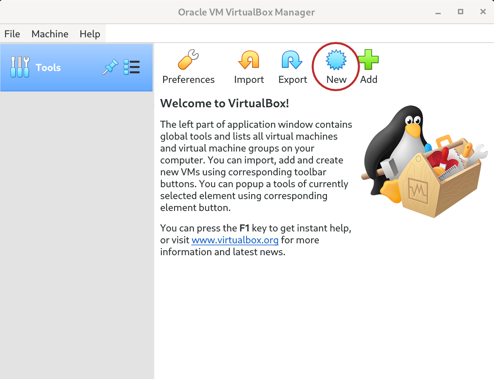
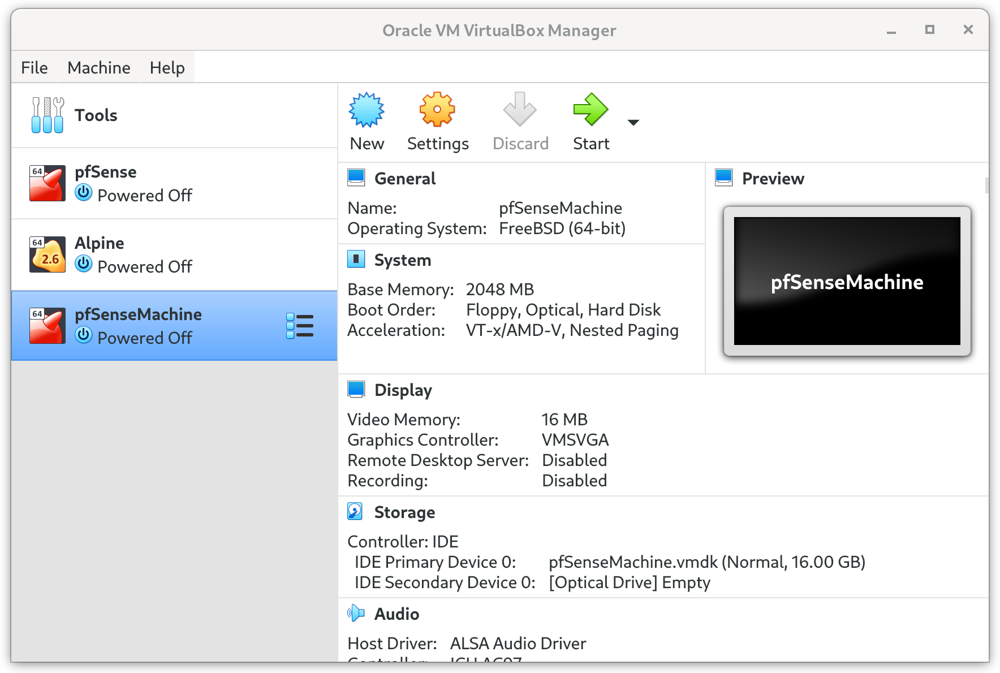

## Part 2. Creating Virtual Machines for pfSense and Alpine Linux

### Step 1. pfSense

You will need to open VirtualBox once it has been downloaded and installed on your computer. In the GUI, you should (unless you already have VirtualBox for unrelated reasons) not see any virtual machines in the side bar. Click on "New" to start the process of creating a pfSense virtual machine.

(image2goeshere)

You should now have the "Create a Virtual Machine" window open on your screen. In the `Name` field, come up with a name for your pfSense VM. I've chosen to name it pfSenseMachine.

You should also choose a file sytem location to install the VM. In most cases, the default location is fine.

In the `Type` field, select BSD, and for `Version`, select FreeBSD (64-bit).

When you're satisfied with your selections, click `Next`.

(image3goeshere)

The amount of memory you allocate to pfSense will depend on what your computer is capable of handling. It should not need very much RAM, and the default is fine, but if you have memory to spare, I recommend increasing it slightly. I have mine set to 2GB.

Once you've decided how much memory to allocate to the machine, click `Next`.

(image4goeshere)

Make sure you select `Create a virtual hard disk now`, and then click `Create`.

(image5goeshere)

Pretty much any of these options is fine, but I've chosen to create a VMDK for pfSense. Select this to stay consistent with this tutorial.

(image6goeshere)

Make sure you select `Dynamically allocated`.

(image7goeshere)

Ensure that you're happy with the location you're creating the virtual machine hard disk. After that, ensure that the size limit is **above 8 GB**. 16 GB is a bit overkill, but I've left it at 16 for the purposes of this tutorial.

Click `Create` to officially instantiate your pfSense Virtual Machine.

(image8goeshere)

You should now see your virtual machine pfSenseMachine (or your chosen name) in the left sidebar of VirtualBox. Go ahead and click on it once, and then click `Settings`.

(image9goeshere)

In Settings, click `Storage`, then under `Storage Devices`, click `Empty`.

On the right, where you see `Optical Drive`, click on the small disk icon and select `Choose a disk file...`

Find the location that you downloaded the pfSense .iso file and select it. If it is zipped, unzip it prior to selecting a file.

(image10goeshere)

Now click `System` on the sidebar of the Settings menu. Next to `Boot Order:` , click on Hard Disk, and click `Move Up` until Hard Disk appears at the top of the boot order (as shown in the image). This will allow you to boot directly into pfSense once it is installed, rather than the virtual boot drive. This prevents an infinite boot loop later on.

(image11goeshere)

Finally, click `Network` in the Settings sidebar. In order to create this virtual environment, pfSense will need two adapters. The first adapter should be attached to `Bridged Adapter`. After you select this, click on the `Adapter 2` tab and select `Enable Network Adapter`. Attach this adapter to `Internal Network`, and give the internal network a name, such as pfSenseLan.

You are now ready to start the virtual machine. Back on the main VirtualBox menu, click on your pfSenseMachine VM and click `Start`.